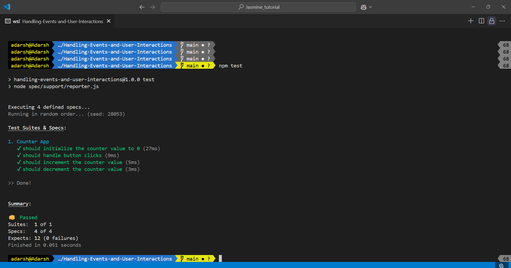

# Handling User events and interactions

In this example, we will test a functionality of a simple counter that increments by one when a button is clicked. We will use Jasmine to test the functionality of the counter.

