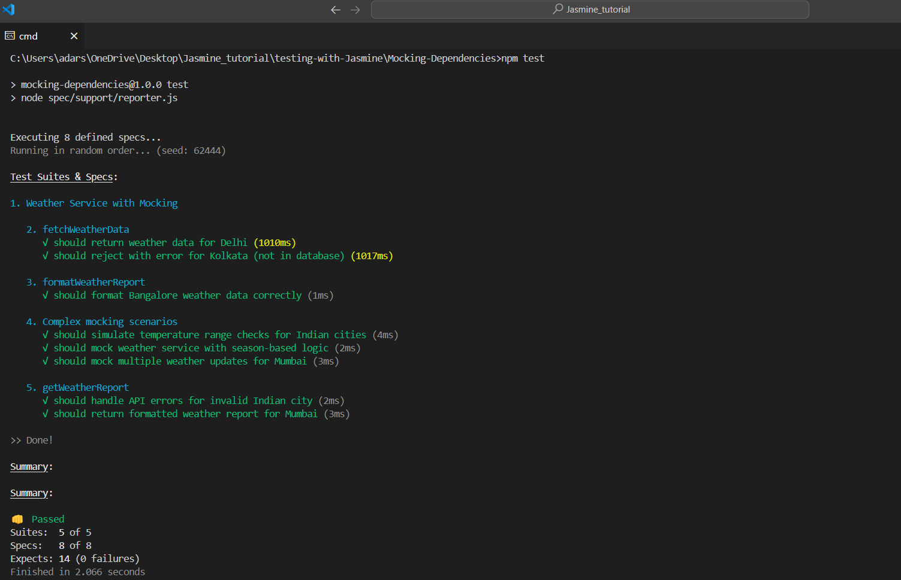

# Mocking Dependencies with Jasmine

Here we will learn how to mock dependencies in Jasmine. We will use the `spyOn` function to mock dependencies.

In Jasmine, we can mock dependencies using the `spyOn` function. This function allows us to replace a method of an object with a spy function. This spy function can be used to track calls to the method and return values.\

