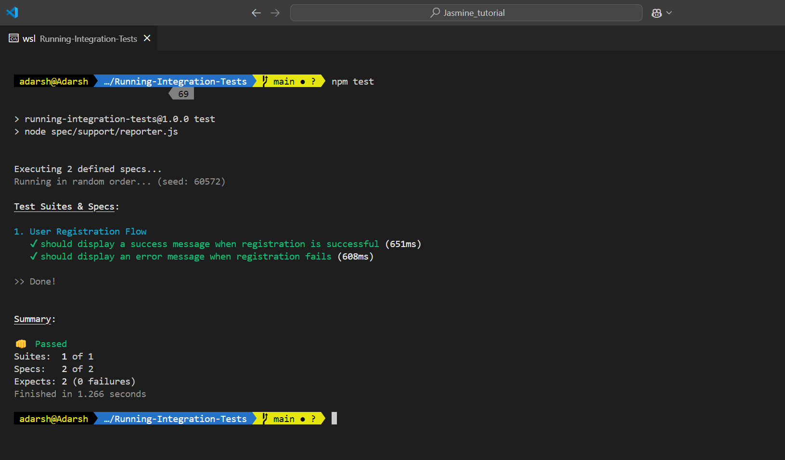

# Running an Integration Test with Jasmine

Here we will run the integration test for a user registration flow. 

The user flow consists of a form wheere you can enter their name, email, and password. The user can submit the form by clicking the submit button. 

