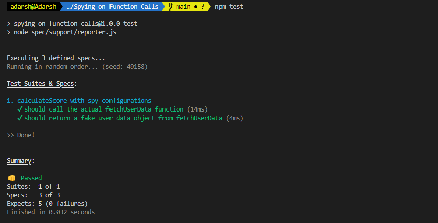

 
# Spying on the Function

Spies in Jasmine allow us to "spy" on the behavior of a function. use case:  useful when testing complex functions that rely on external dependencies or functions that are called multiple times [Jasmine Official Spying On Properties](https://jasmine.github.io/tutorials/spying_on_properties).

