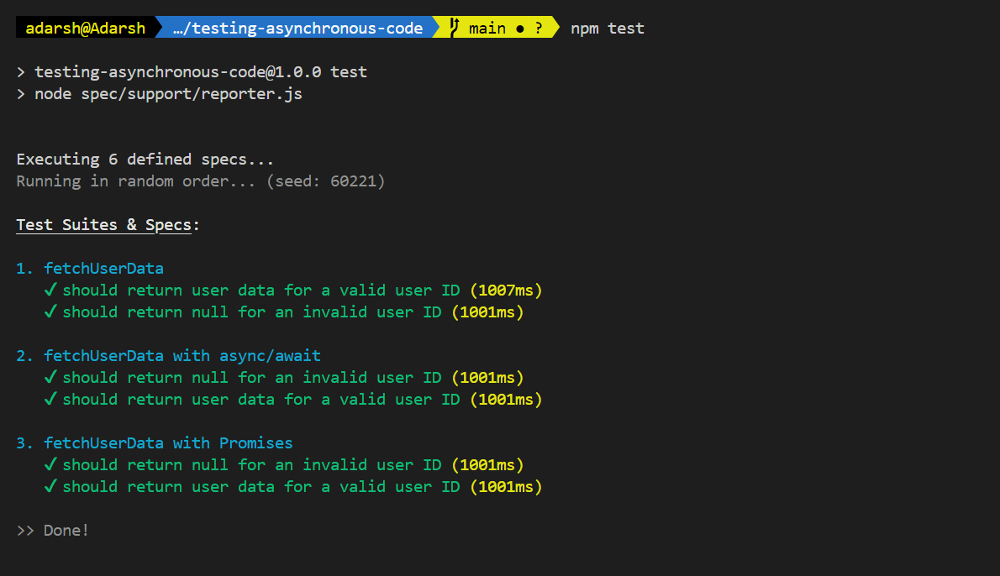

# Testing Asynchronous Code with Jasmine

Asynchronous operations are the most common part of modern JavaScript applications [dealing with APIs, database calls, or timeouts.]

In this section, you will learn how to test asynchronous code using Jasmine.

We will test asynchronous functions using callbacks, Promises, and async/await.

## Instructions

1. npm install jasmine --dev
2. npm install
3. npx jasmine init
4. npm test

## Screenshots

 

