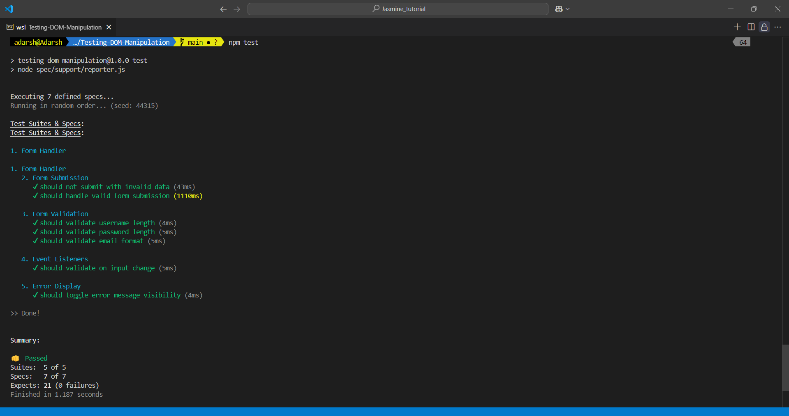

# Testing DOM Manipulation

Here we test the DOM manipulation using Jasmine. We have a form element in the HTML file and we are testing the form submission, form valdation etc using Jasmine.

## How to run the test

1. Clone the repository
2. Open the `index.html` file in the browser
3. npm install
4. npm test

# output

