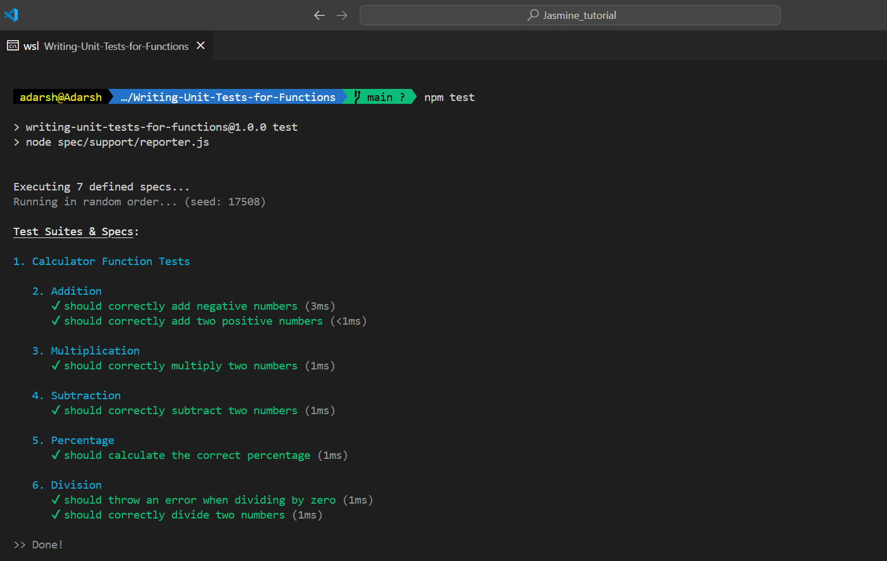
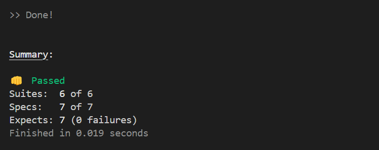

<!-- include images from current folder -->

## Writing Unit Tests for Functions

In this, you will write unit tests for a function that mimics a calculator

### Instructions

1. npm install jasmine --dev

2. npx jasmine init

3. npm test

### Screenshots

